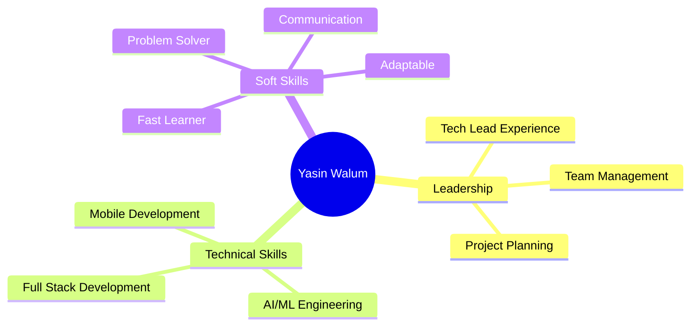

# Hi there, I'm Yasin Walum 👋

<div align="center">
  
  [](https://git.io/typing-svg)

</div>

## 🚀 About Me

I'm a **Computer Scientist** and **Tech Lead** passionate about building **scalable, AI-powered solutions** that solve real-world problems. With expertise spanning **full-stack development**, **machine learning**, and **IoT systems**, I transform ideas into impactful digital products.

```typescript
const yasin = {
  code: ["JavaScript", "TypeScript", "Python", "Dart", "Kotlin", "Go", "Java", "C"],
  askMeAbout: ["web dev", "mobile dev", "AI/ML", "data science", "IoT", "cybersecurity"],
  technologies: {
    frontEnd: {
      js: ["React", "Next.js", "Remix"],
      css: ["Tailwind CSS", "Material UI", "Styled Components"]
    },
    backEnd: {
      js: ["Node.js", "Express", "NestJS"],
      python: ["Django", "Flask", "FastAPI"]
    },
    mobile: ["React Native", "Flutter", "Expo"],
    databases: ["MongoDB", "PostgreSQL", "MySQL", "Firebase"],
    aiML: ["TensorFlow", "PyTorch", "Scikit-learn", "OpenCV"],
    devOps: ["Docker", "Git", "GitHub Actions", "AWS"],
  },
  currentFocus: "Building intelligent systems with AI + IoT",
  funFact: "I debug with coffee and solve problems with creativity ☕️"
};
```

---

## 💼 What I Do

<table>
<tr>
<td width="50%">

### 🎨 Frontend Development
- ⚛️ Modern React & Next.js applications
- 📱 Cross-platform mobile apps (React Native, Flutter)
- 🎯 Responsive, accessible UI/UX
- ⚡ Performance optimization & SEO

</td>
<td width="50%">

### ⚙️ Backend Development
- 🏗️ RESTful & GraphQL APIs
- 🔐 Secure authentication systems
- 📊 Database design & optimization
- ☁️ Cloud deployment & scaling

</td>
</tr>
<tr>
<td width="50%">

### 🤖 AI & Machine Learning
- 👁️ Computer Vision systems
- 💬 Natural Language Processing
- 📈 Predictive analytics & modeling
- 🧠 Deep learning applications

</td>
<td width="50%">

### 🌐 IoT & Smart Systems
- 🌱 Agriculture & health tech
- 📡 Sensor integration
- 📊 Real-time data processing
- 🔗 AI-IoT hybrid solutions

</td>
</tr>
</table>

---

## 🛠️ Tech Stack

### Languages


### Frontend


### Mobile


### Backend


### Database & Cloud


### AI/ML & Data Science


### Tools & DevOps


---

## 🏆 Featured Projects

<table>
<tr>
<td width="50%">

### 🩺 Aurora Skin Analyzer
AI-powered diagnostic system using **EfficientNet** for skin condition detection, integrated with IoT devices for real-time health monitoring.

**Tech:** `Python` `TensorFlow` `FastAPI` `React` `IoT`

</td>
<td width="50%">

### 🌱 Smart Agriculture Platform
Final year project combining **AI + IoT** for precision farming, crop monitoring, and automated irrigation systems.

**Tech:** `Python` `Flutter` `Django` `IoT Sensors` `ML`

</td>
</tr>
<tr>
<td width="50%">

### 💰 AI Financial Planning Assistant
Machine learning system providing personalized financial advice and investment recommendations.

**Tech:** `Python` `Scikit-learn` `Next.js` `FastAPI`

</td>
<td width="50%">

### 🎓 Face Recognition Attendance
Automated attendance management system using face recognition technology for educational institutions.

**Tech:** `Next.js` `OpenCV` `Python` `MongoDB`

</td>
</tr>
<tr>
<td width="50%">

### 💼 CMS Portfolio Platform
Full-stack content management system with cloud storage integration and dynamic portfolio generation.

**Tech:** `Next.js` `Express` `MongoDB` `Cloudinary`

</td>
<td width="50%">

### 🛒 E-Commerce Platform
Scalable online marketplace with payment integration, inventory management, and analytics dashboard.

**Tech:** `Next.js` `FastAPI` `PostgreSQL` `Stripe`

</td>
</tr>
</table>

---

## 📊 GitHub Statistics

<div align="center">
  
  
</div>

<div align="center">
  
  
</div>

---

## 🏅 Achievements & Recognition

<div align="center">
  


</div>

- 🎯 **Tech Lead** managing 10+ member development teams
- 🚀 Successfully deployed **15+ production applications**
- 📱 Built **AI-powered mobile apps** with 10K+ users
- 🏆 Winner of multiple **hackathons** and coding competitions
- 📚 Active contributor to **open-source projects**

---

## 📈 Contribution Graph

<div align="center">
  


</div>

---

## 🌟 Core Strengths



---

## 📫 Let's Connect

<div align="center">

[](https://www.linkedin.com/in/yasin-walum)
[](https://yasin-walum.vercel.app/)
[](https://youtube.com/@YasynDotDev)
[](mailto:yasinwalum@example.com)

</div>

---

<div align="center">
  
### 💡 "Code is like humor. When you have to explain it, it's bad." – Cory House


**⭐️ From [wyasyn](https://github.com/wyasyn) | Let's build something amazing together! 🚀**

</div>
